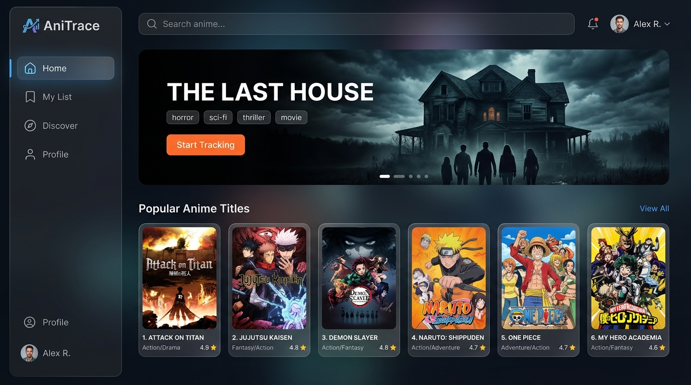

<div align="center">
  
  
  <br />
  <br />
  
  
  
  # AniTrace
  
  **Your ultimate, distraction-free watch companion.** Track your anime, TV series, and movies with zero bloat and absolute speed, supercharged by Gemini AI & TMDB.
  
  [Live Demo](https://senpaiisync.web.app/) • [Report Bug](https://github.com/darvex-0/AniTrace/issues) • [Request Feature](https://github.com/darvex-0/AniTrace/issues)
  
  [](https://vitejs.dev/)
  [](https://react.dev/)
  [](https://tailwindcss.com/)
  [](https://firebase.google.com/)
  [](https://deepmind.google/technologies/gemini/)
</div>

---

## 📽️ Why AniTrace?

Most tracking sites are either covered in intrusive ads, feel like spreadsheets from 2012, or take ages to load on mobile. I wanted a modern dashboard that gets out of the way, looks stunning on a desk monitor or phone, and is smart enough to handle massive franchises without manual data entry.

AniTrace integrates the **TMDB API** for rich metadata and **Gemini 2.5 Flash** for AI-assisted autocomplete and franchise mapping (automatically discovering prequels, sequels, and spin-offs in a click).

---

## ✨ Features

- 🌌 **Gorgeous Glassmorphic Dashboard:** Dark mode by default, vibrant gradients, and fluid micro-animations (powered by Framer Motion).
- 🧠 **AI Autocomplete & Estimation (Optional):** Enter a partial title, and let Gemini estimate total seasons, episodes, and generate a brief clean synopsis.
- 🔗 **Smart Franchise Mapping:** Instantly discovers prequel/sequel relations and lets you connect them to your watchlist.
- ⚡ **Realtime Cloud Sync:** Powered by Firebase Authentication and Firestore to save your list instantly across all devices.
- 📱 **Fully Responsive:** Feels like a native app on mobile, tablet, or desktop.
- 🚫 **Ad-free & Tracker-free:** Just your watch list, your way.


## 🛠️ Tech Stack

- **Frontend:** React 18 (TypeScript), Vite, Tailwind CSS, Framer Motion
- **UI Components:** Shadcn/ui (Radix Primitives)
- **Backend:** Firebase (Auth, Firestore, Hosting)
- **APIs:** TMDB API (Base movie/show searches), Google Gemini 2.5 Flash API (Smart predictions & franchise connections)

---

## 🚀 Quick Start (Local Setup)

Get it up and running locally in under 2 minutes:

### 1. Clone the repository
```bash
git clone https://github.com/darvex-0/AniTrace.git
cd AniTrace
```

### 2. Install dependencies
```bash
npm install
```

### 3. Setup Environment Variables
Copy the example environment file:
```bash
cp .env.example .env
```
Open `.env` and fill in your keys:
```env
VITE_TMDB_API_KEY=your_tmdb_api_key
VITE_GEMINI_API_KEY=your_gemini_api_key
```

> [!IMPORTANT]
> - **TMDB API Key:** Required for basic search and metadata queries. Grab a free API key from your [TMDB account settings](https://www.themoviedb.org/documentation/api).
> - **Gemini API Key:** Unlocks AI autocomplete, smart episode/season count estimation, and franchise timeline mapping. Get a key from the [Google AI Studio](https://aistudio.google.com/).
>
> **How to configure the Gemini API Key:**
> - **Option 1: Directly in the Web App UI (Recommended):** You can enter your Gemini API Key directly inside the app by going to the **Profile** page and scrolling to **AI Autocomplete Settings**. This saves the key securely inside your browser's local storage (no environment variable setup needed!).
> - **Option 2: Via Local Environment:** You can paste your key in the `.env` file as `VITE_GEMINI_API_KEY` to load it permanently for local development.

### 4. Setup Firebase (Optional)
This project uses Firebase. You can replace the default firebase config in `src/lib/firebase.ts` with your own project credentials.

### 5. Start development server
```bash
npm run dev
```
Open [http://localhost:5173](http://localhost:5173) in your browser!

---

## 🧪 Running Tests
We use Vitest for lightning-fast testing:
```bash
npm run test
```

---

## 🤝 Contributing

Contributions make the open-source community an amazing place. Any contributions you make are **greatly appreciated**.

1. Fork the Project
2. Create your Feature Branch (`git checkout -b feature/AmazingFeature`)
3. Commit your Changes (`git commit -m 'Add some AmazingFeature'`)
4. Push to the Branch (`git push origin feature/AmazingFeature`)
5. Open a Pull Request

---

## 📝 License
Distributed under the MIT License. See [`LICENSE`](file:///c:/Users/Rakesh/Vs%20code/AniTrace/AniTrace/LICENSE) for more information.

---

<div align="center">
  Created with ❤️ by <a href="https://github.com/darvex-0">darvex-0</a>
</div>
